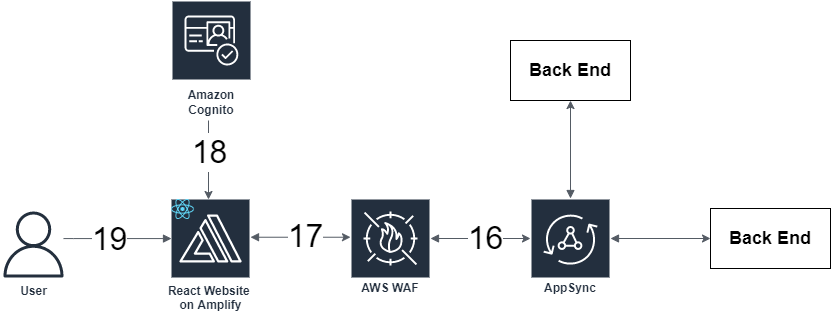
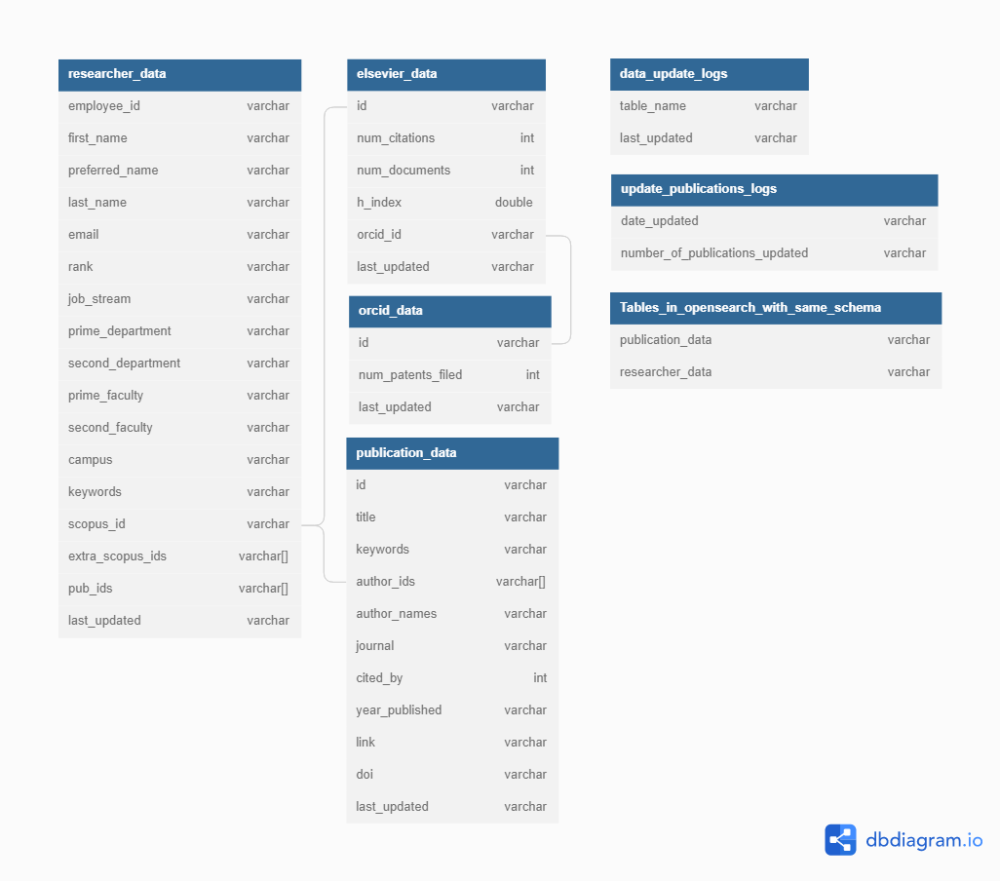

# Backend and Frontend Stack Deep Dive

## Architecture

## Description
### Back End Flow (1-15)

Steps 1-9 are explored in more detail as part of the [Data Pipeline Deep Dive](docs/DataPipeline.md)

1. Raw Scopus and UBC HR data are fetched from an Amazon S3 bucket in the form of comma separated values (CSV) files. Both datasets are cleaned which involves standardizing the names present in both datasets. The results are then stored as CSV files in a new folder within the S3 bucket.
2. The standardized names are compared in order to match Scopus Ids to UBC HR data. This process uses a string metric called Jaro-Winkler distance in order to determine if two names are the same. The match that has the highest Jaro-Winkler distance is considered to be the closest match. If the Jaro-Winkler distance is above a certain threshold the match is considered final. If the match is below the threshold then the match requires further processing in step 3. If two or more potential matches have the same Jaro-Winkler Distance those matches are processed further in step 4.
3. The matches that failed to meet the Jaro-Winkler distance threshold are further processed by comparing data obtained from Scopus to the UBC HR data. First there is a comparison between the researchers department and subject area data from Scopus. Next there is a comparison between the researchers name and name variants present on Scopus.
4. The researchers that have been matched to more than one Scopus Id are processed further by comparing Scopus subject area and name variant data against UBC department and faculty data.
5. Researchers whose Scopus Id’s were identified in steps 2-4 have their data stored in the Postgres database.
6. For each Scopus Id in the database, metrics are fetched from the SciVal and Scopus APIs. Number of documents, number of citations, and ORCID Id are obtained from Scopus and a 5-year h-index is obtained from SciVal. This data is stored in the Postgres database.
7. The number of filed patents listed on ORCID is fetched from the ORCID API and stored in the database
8. Each researcher's publication data is fetched from the Scopus API and stored in the database. This data includes each publication’s title, associated keywords, author names and Scopus ids, journal title, and the number of times the publication has been cited.
9. The start replication lambda will start the DMS replication task to replicate data from the postgresql database to AWS opensearch to make the data searchable on the webapp.
10. Every Saturday at midnight a python docker container hosted on AWS fargate will be run to update the publications of the researchers in the database. The container will update researcher’s h-indexes and number of publications. Update publications will also add newly published publications to the database and remove publications with no current UBC researchers.
11. Once per week the AWS DMS task will be run to replicate data from the PostgreSQL database to AWS opensearch. This makes the data searchable and keeps the searches up to date.
12. When queried, the Lambda communicates with AWS OpenSearch and executes the search required.
13. AWS Appsync triggers the OpenSearch Lambda and passes the correct variables needed to execute the query.
14. When queried, Lambda connects to the RDS PostgreSQL database and gets the data requested by AppSync.
15. AWS AppSync triggers the PostgreSQL Lambda and passes the correct variables needed to get the required data.

### Front End Flow (16-19)

16. All queries approved by AWS Web Application Firewall (WAF) are passed to AppSync.
17. All queries are first sent to AWS WAF. This helps prevent malicious users from getting data or breaking the website with DDOS attacks.
18. Users connect to the webpage, where access to AWS resources is done through authentication using AWS Cognito.
19. Users navigate to the VPRI application in their web browser.

# Update Publications Deep Dive (10)

The goal of the update publications feature is to keep the database up to date when researchers publish new papers.

## How often update publications is run:

Update publications is run once a week at midnight (UTC time) on Saturday. To accomplish this, the following cron expression is used (0 0 ? * SAT *) (minute, hour, Day-of-month, Month, Day-of-week, Year). When the cron expression triggers, a Python docker container is launched on AWS Fargate. When the container is running, it runs a series of Python functions to update and add publications to the database.

## What Tables and Columns are Changed:

When update publications is run, each researcher has their h-index value and last_updated value in the elsevier table updated. The last_updated value indicates to the user that a researcher’s data is up to date.

If a researcher has published a paper since the update publications function last ran, the following values will be changed in that researcher’s row in the researchers table: num_documents and keywords. Each newly published publication will be added to the publications table.

## Update Publications Flow of Code:

### Remove Publications without UBC author:
This function removes all the publications in the database that do not have an active UBC researcher listed as an author. An active UBC researcher is someone who has a row in the researchers table. Papers may get deleted because a researcher is removed from the researchers table or because a researcher's Scopus ID is changed. 

### Update All Researcher Number Of Documents:
This function queries the database for each researcher and sets the num_documents to a new value if required.

### Create List of Researchers that need to be updated:
This function queries the database and Scopus to check if a researcher needs to be updated. If the researcher has less documents in the database than on Scopus the researcher must be updated and the code adds them to a list. This function also updates every researcher's h-index regardless of their number of documents changing. This is because their h-index can change even if they don’t publish a new paper.

### Update Researchers:
This function fetches the publications of each researcher. There is a limitation with Scopus when you query for an author's publications. For each publication it will only show the first 100 authors on the publication, which can cause problems because UBC authors on those publications might not be in the first 100 authors. So when the update publications function comes across a publication there are four possible options:
The publication is not in the database and the publication has less than 100 authors.
The publication is in the database and has less than 100 authors.
The publication is not in the database and has more than 100 authors.
The publication is in the database and has more than 100 authors.

#### The publication is not in the database and the publication has less than 100 authors:
Add the publication to the database, update any researchers num_documents who were a part of this publication and add to those researchers’ keywords with the keywords attached to this publication.

#### The publication is in the database and has less than 100 authors:
The code skips this publication because it is already in the database. Every author should have the keywords already and their num_documents should include this publication.

#### The publication is not in the database and has more than 100 authors:
Check if the author which is being queried for in Scopus appears in the first 100 authors. If that author does not appear in the first 100, add that author to the array of author IDs and author names, then add the publication to the database and update any UBC authors’ keywords and num_documents.

#### The publication is in the database and has more than 100 authors:
Check if the publication has the queried author’s ID stored. If the author is already attached to the paper, skip this publication. If the author is not attached to the paper, add the current author to the publication, update the author’s keywords and increase their number of documents by one.

