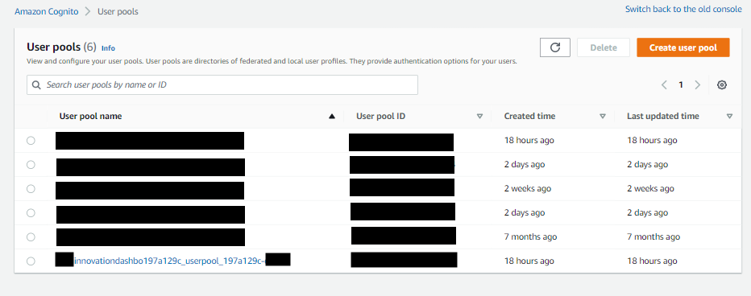
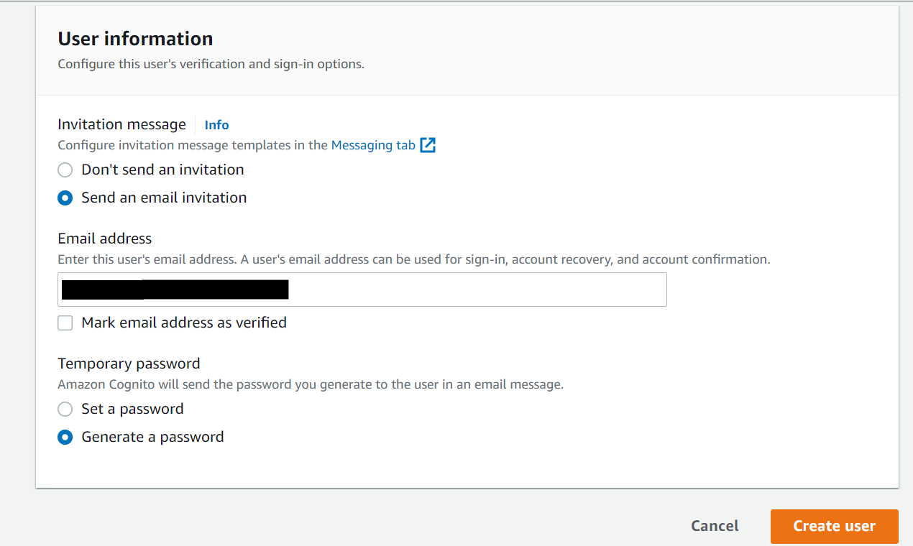

# Requirements

Before you deploy, you must have the following installed on your device:

- [AWS Account](https://aws.amazon.com/account/)
- [GitHub Account](https://github.com/)
- [AWS CLI](https://aws.amazon.com/cli/)
- [AWS SAM](https://docs.aws.amazon.com/serverless-application-model/latest/developerguide/serverless-sam-cli-install.html)

If you are on a Windows device, it is recommended to install the [Windows Subsystem For Linux](https://docs.microsoft.com/en-us/windows/wsl/install), which lets you run a Linux terminal on your Windows computer natively. Some of the steps will require its use. [Windows Terminal](https://apps.microsoft.com/store/detail/windows-terminal/9N0DX20HK701) is also recommended for using WSL.

# Step 1: Clone The Repository

First, clone the GitHub repository onto your machine. To do this:

1. Create a folder on your computer to contain the project code.
2. For an Apple computer, open Terminal. If on a Windows machine, open Command Prompt or Windows Terminal. Enter into the folder you made using the command `cd path/to/folder`. To find the path to a folder on a Mac, right click on the folder and press `Get Info`, then select the whole text found under `Where:` and copy with ⌘C. On Windows (not WSL), enter into the folder on File Explorer and click on the path box (located to the left of the search bar), then copy the whole text that shows up.
3. Clone the github repository by entering the following:

```bash
git clone https://github.com/UBC-CIC/VPRI-innovation-dashboard.git
```

The code should now be in the folder you created. Navigate into the folder containing the Amplify project by running the command:

```bash
cd VPRI-innovation-dashboard
```

# Step 2: Frontend Deployment

Before installing Amplify we need to create the IAM Role that gives us the permissions needed to implement this solution. Run the following line of code:

```bash
aws cloudformation deploy --template-file cfn-amplifyRole.yaml --stack-name amplifyconsole-vpri-backend-role --capabilities CAPABILITY_NAMED_IAM
```

If you have multiple AWS Profiles, specify one with sufficient admin permissions by appending the following text to the end of the command, replacing the profile name with the profile you would like to use for the solution (If you do this, be sure to include the same `--profile` argument for the rest of the commands starting with `aws`. The profile you are using for this project should have administrator privliges).

```bash
--profile [PROFILE NAME]
```

This step creates the IAM role called **amplifyconsole-vpri-backend-role** that will be used on the next step.

The **Deploy to Amplify Console** button will take you to your AWS console to deploy the front-end solution.

<a href="https://console.aws.amazon.com/amplify/home#/deploy?repo=https://github.com/UBC-CIC/VPRI-innovation-dashboard">
    
</a>

1. On the AWS console. select your region on the top right, then connect to GitHub.
   
2. Select the **amplifyconsole-vpri-backend-role** we made previously for the deployment role, and then press `Save and Deploy`
3. The deployment will take a few minutes. Wait until the status shows **Verify** in green
4. Click on left taskbar to open menu, click on Rewrites and redirects, and click on edit
5. Click and replace the first rule's source address (or add a rule if there is none) to `</^((?!\.(css|gif|ico|jpg|js|png|txt|svg|woff|ttf)$).)*$/>`, click and replace target address to `/index.html`, and select and replace **type** with `200 (Rewrite)`, then save. Add a second rule, with the source address as `</^((?!\.(css|gif|ico|jpg|js|png|txt|svg|woff|ttf)$).)*$/>`, the target address as `/index.html`, and the **type** with `404 (Rewrite)`.
   Refer to [AWS's Page on Single Page Apps](https://docs.aws.amazon.com/amplify/latest/userguide/redirects.html#redirects-for-single-page-web-apps-spa) for further information on why we did that
   

   # Step 3: Backend Deployment

# Step 4: Creating a User

To set up user accounts on the app, you will need to do the following steps

1. At the [AWS online console](https://console.aws.amazon.com/console/home), enter `Cognito` in the search bar.
   
2. Click `User Pools` from the left hand sidebar and select the user pool that was created.
   
3. Click the `Users` tab, then click `Create User`.
   
4. For Invitation message, select `Send an email invitation`. Then fill in the user's email address in the Email address text field below. For Temporary password, select `Generate a password`. THen click `Create User`.
   
5. The user will receive an email to the email address that was previously entered containing their temporary password.
   
6. When the user enters their email and temporary password on the sign in page of the app, they will then be prompted to replace their temporary password by setting a new password.
   
7. The new user account has been created!
