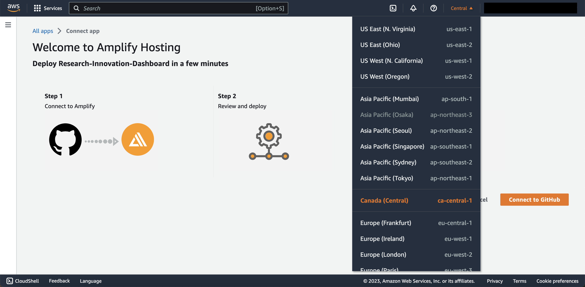
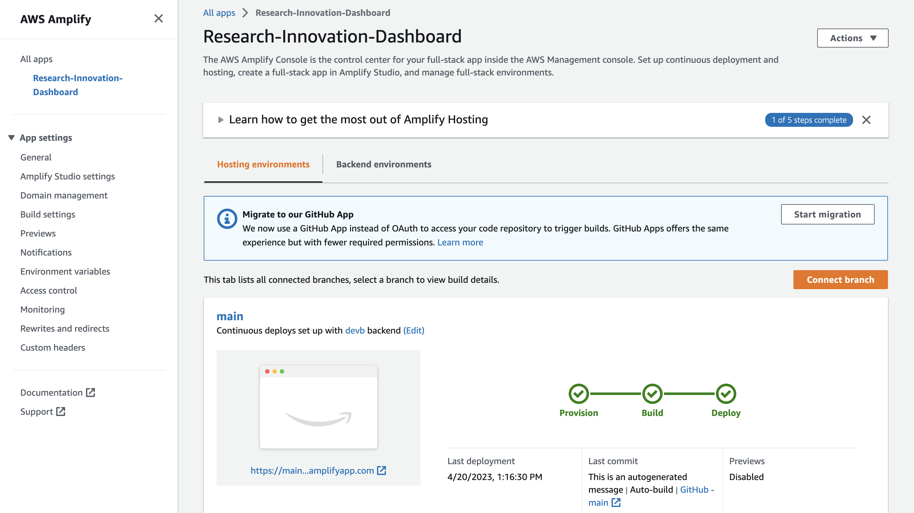
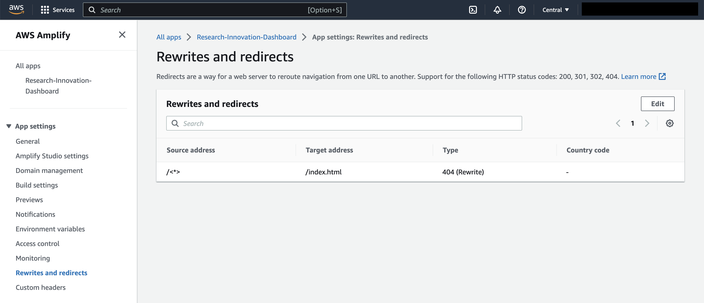
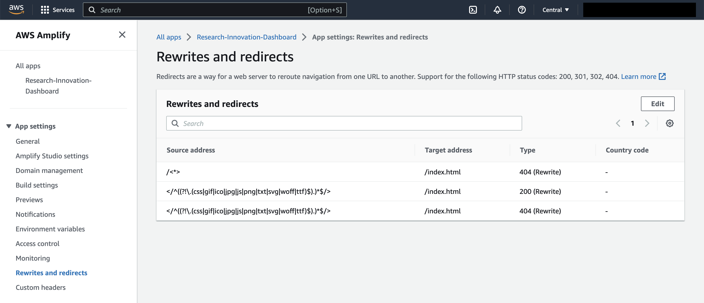
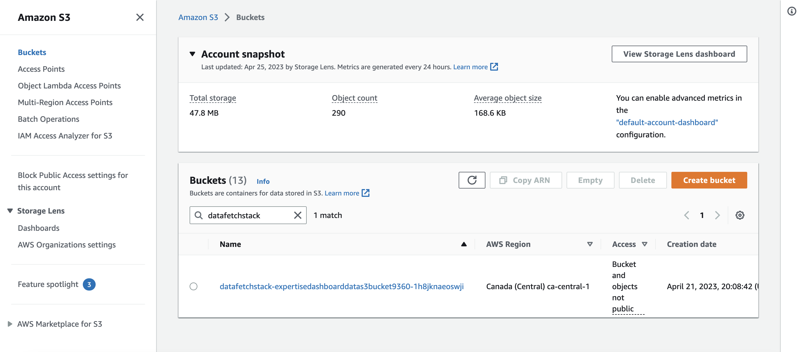
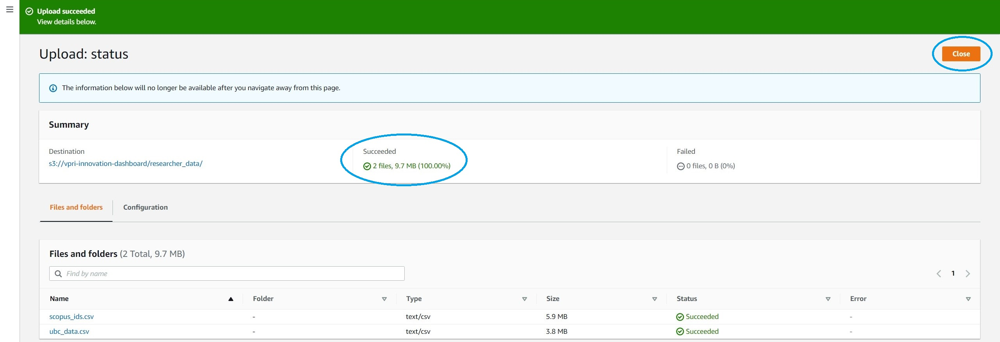
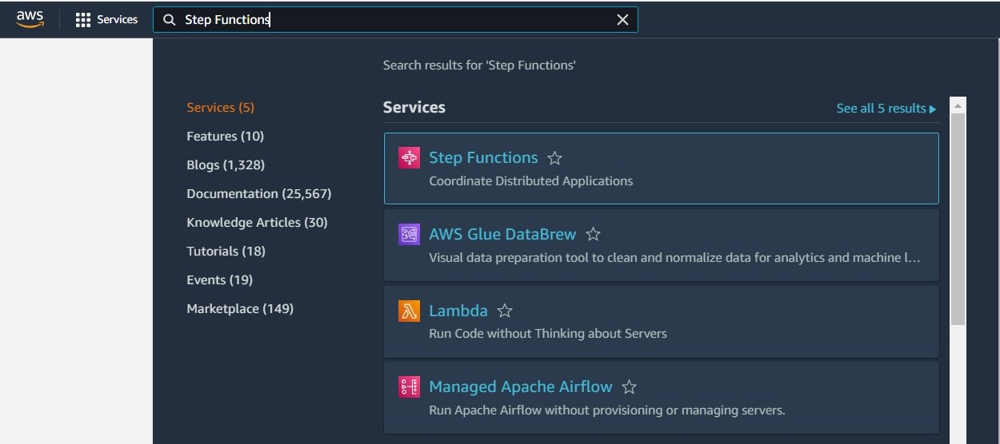
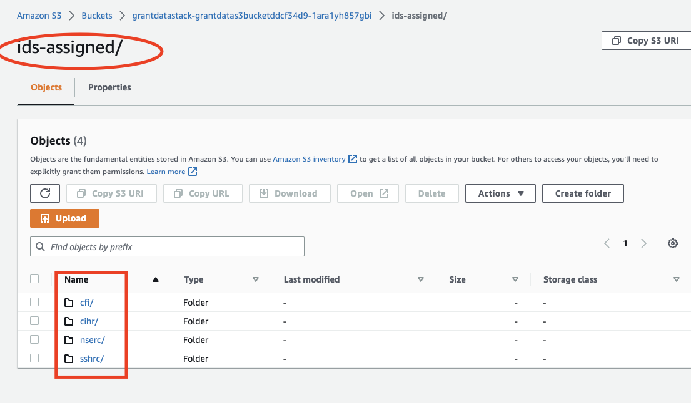
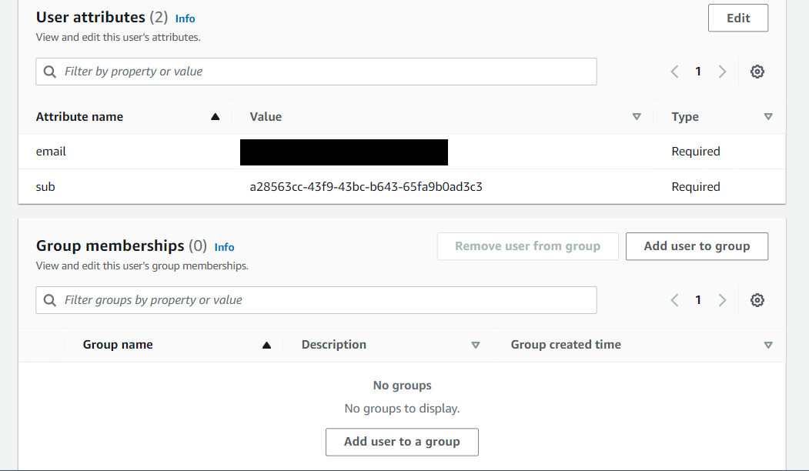
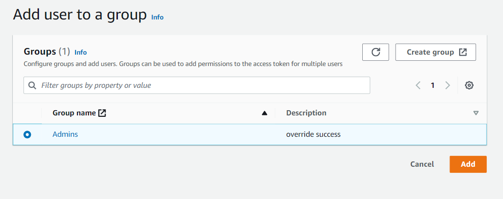

# Requirements

Before you deploy, you must have the following installed on your device:

- [AWS Account](https://aws.amazon.com/account/)
- [GitHub Account](https://github.com/)
- [AWS CLI](https://aws.amazon.com/cli/)
- [AWS CDK](https://docs.aws.amazon.com/cdk/latest/guide/cli.html)
- [Docker Desktop](https://www.docker.com/products/docker-desktop/)

**Once you have downloaded docker desktop launch and setup the application. Once the application is setup leave it running.**

If you are on a Windows device, it is recommended to install the [Windows Subsystem For Linux](https://docs.microsoft.com/en-us/windows/wsl/install), which lets you run a Linux terminal on your Windows computer natively. Some of the steps will require its use. [Windows Terminal](https://apps.microsoft.com/store/detail/windows-terminal/9N0DX20HK701) is also recommended for using WSL.

# Step 1: Clone The Repository

First, clone the GitHub repository onto your machine. To do this:

1. Create a folder on your computer to contain the project code.
2. For an Apple computer, open Terminal. If on a Windows machine, open Command Prompt or Windows Terminal. Enter into the folder you made using the command `cd path/to/folder`. To find the path to a folder on a Mac, right click on the folder and press `Get Info`, then select the whole text found under `Where:` and copy with ⌘C. On Windows (not WSL), enter into the folder on File Explorer and click on the path box (located to the left of the search bar), then copy the whole text that shows up.
3. Clone the github repository by entering the following:

```bash
git clone https://github.com/UBC-CIC/Research-Innovation-Dashboard.git
```

The code should now be in the folder you created. Navigate into the folder containing the Amplify project by running the command:

```bash
cd Research-Innovation-Dashboard
```

# Step 2: Frontend Deployment

Before installing Amplify we need to create the IAM Role that gives us the permissions needed to implement this solution. Run the following line of code:

```bash
aws cloudformation deploy --template-file cfn-amplifyRole.yaml --stack-name amplifyconsole-vpri-backend-role --capabilities CAPABILITY_NAMED_IAM
```

If you have multiple AWS Profiles, specify one with sufficient admin permissions by appending the following text to the end of the command, replacing the profile name with the profile you would like to use for the solution (If you do this, be sure to include the same `--profile` argument for the rest of the commands starting with `aws`. The profile you are using for this project should have administrator privliges).

```bash
--profile [PROFILE NAME]
```

This step creates the IAM role called **amplifyconsole-vpri-backend-role** that will be used on the next step.

The **Deploy to Amplify Console** button will take you to your AWS console to deploy the front-end solution.

<a href="https://console.aws.amazon.com/amplify/home#/deploy?repo=https://github.com/UBC-CIC/Research-Innovation-Dashboard">
    
</a>

1. On the AWS console. select your region on the top right, then connect to GitHub.
   
2. Select the **amplifyconsole-vpri-backend-role** we made previously for the deployment role, and then press `Save and Deploy`
3. The deployment will take a few minutes. Wait until the status shows **Verify** in green
4. Click on left taskbar to open menu, click on Rewrites and redirects, and click on edit
5. Click and replace the first rule's source address (or add a rule if there is none) to `</^((?!\.(css|gif|ico|jpg|js|png|txt|svg|woff|ttf)$).)*$/>`, click and replace target address to `/index.html`, and select and replace **type** with `200 (Rewrite)`, then save. Add a second rule, with the source address as `</^((?!\.(css|gif|ico|jpg|js|png|txt|svg|woff|ttf)$).)*$/>`, the target address as `/index.html`, and the **type** with `404 (Rewrite)`.
   Refer to [AWS's Page on Single Page Apps](https://docs.aws.amazon.com/amplify/latest/userguide/redirects.html#redirects-for-single-page-web-apps-spa) for further information on why we did that
   

# Step 2: Backend Deployment

It's time to set up everything that goes on behind the scenes! For more information on how the backend works, feel free to refer to the Architecture Deep Dive, but an understanding of the backend is not necessary for deployment.

## Step 1: Install Dependencies

The first step is to get into the backend folder. This can be done with the following commands:

```bash
cd back_end
cd cdk
```

Now that you are in the backend directory, install the core dependencies with the following command:

```bash
npm install
```

## Step 2: Upload the Elsevier API Key and Institution Token

While in the `back_end/cdk` folder, run the following commands. Ensure you replace "INSTITUTION_TOKEN" in the first command with your own Elsevier institution token and you replace "API_KEY" in the second command with your own Elsevier API key.

```bash
aws ssm put-parameter --name "/service/elsevier/api/user_name/instoken" --value "INSTITUTION_TOKEN" --type SecureString --overwrite
aws ssm put-parameter --name "/service/elsevier/api/user_name/key" --value "API_KEY" --type SecureString --overwrite
```

## Step 3: CDK Deployment

Initialize the CDK stacks (required only if you have not deployed this stack before). Note the CDK deployment assumes you are deploying in ca-central-1

```bash
cdk synth --profile your-profile-name
cdk bootstrap aws://YOUR_AWS_ACCOUNT_ID/ca-central-1 --profile your-profile-name
```

Deploy the CDK stacks (this will take 30-45 minutes):

If you run into any issues while deploying, refer to [Troubleshooting](#troubleshooting) for solutions.

You must also deploy the stacks individually (it is important to deploy the stack listed in the order below):

```
cdk deploy VpcStack  --profile your-profile-name
```

```
cdk deploy DatabaseStack  --profile your-profile-name
```

```
cdk deploy OpensearchStack --profile your-profile-name
```

```
cdk deploy DmsStack --profile your-profile-name
```

```
cdk deploy AppsyncStack --profile your-profile-name
```

```
cdk deploy FargateStack --profile your-profile-name
```

```
cdk deploy DataFetchStack --profile your-profile-name
```

```
cdk deploy GrantDataStack --parameters GrantDataStack:cfiInstitutionName="Your Institution Name" --profile your-profile-name
```

**Note for deploying the GrantDataStack**: when you obtain the CSV file for the **CFI** grant data, you must make a note of the name of your institution that appears under the `Institution / Établissement` column. For example: if your institution name is *The University of British Columbia*,
then you would do:
```
cdk deploy GrantDataStack --parameters GrantDataStack:cfiInstitutionName="The University of British Columbia" --profile your-profile-name
```

# Step 4: Upload Data to S3 for the DataPipeline

1. Follow this [link](https://www.scival.com/overview/authors?uri=Institution/501036) to the Scival page for UBC and sign in. Click on the `Export` dropdown menu then click `Download full list of authors (CSV)`. Rename the file to `scopus_ids.csv`.
   
2. Ensure you have a file containing researcher HR data. An example of how this file should be structured can be found here: [Example HR Data File](example_data/hr_data(example).csv). This file must be named `ubc_data.csv`
3. At the [AWS online console](https://console.aws.amazon.com/console/home), enter `S3` in the search bar.
   
4. In the `Buckets` search bar enter `datafetchstack` and click on the name of the bucket.
   
5. Click on `Create Folder`
   
6. Enter `researcher_data` as the folder name then click `Create Folder`.
   
7. Click on the `researcher_data` folder then click `Upload`.
   
8. Click `Add Files` and select the `scopus_ids.csv` file and the `ubc_data.csv` file (also if you have a file of manually matched researcher profiles upload them as well. The file must be named `manual_matches.csv` and should be structured like the following file: [Example Matches File](example_data/manual_matches(example).csv)) then click `Upload`.
   
9. Once the upload is complete click `Close`
   

# Step 5: Run the Data Pipeline

1. At the [AWS online console](https://console.aws.amazon.com/console/home), enter `Step Functions` in the search bar.
   
2. In the State Machine search bar enter `DataFetchStateMachine` and click the name of the top result (The exact name of the state machine may vary but it will always begin with `DataFetchStateMachine`.
   
3. Click `Start Execution`
   
4. In the box that appears click `Start Execution`. Do not edit the text in the input field.
   
5. The data pipeline will now run on its own and populate the database. This process will take ~90 minutes. If you navigate to the page you visited in part 2 of this step you can view the status of the data pipeline. Once it is finished running the step function execution status will say `Succeeded`.
   

6. **ONLY NOW can You move to** [Step 6](#step-6-upload-data-to-s3-for-the-grant-data-pipeline) below for the Grant Data Pipeline.

# Step 6: Upload data to S3 for the Grant Data Pipeline

1. Refer to the [User Guide to Grant Downloads](/User%20Guide%20to%20Grant%20Downloads.pdf) for instructions on how to obtain the grant data for your institution.
2. At the [AWS online console](https://console.aws.amazon.com/console/home), enter `S3` in the search bar. Find the bucket whose name starts with `grantdatastack-grantdatas3bucket` (the full name will have some random alpha-numeric letter after that initial identifier).
3. There are a folder called `raw` already created for you at deployment, and it contains 4 subfolders (`cihr`, `cfi`, `nserc`, `sshrc`). Inside each of the subfolder, put the corresponding CSV file for that grant there. For SSHRC, please also remember to include the `sshrc_program_codes.csv` file along with the SSHRC grant data CSV file. The resulting folder structure should look like this:
   

**NOTE**: 

+ If you found out that you there was a mistake in the uploading process, either you put the wrong files in the wrong folders, or there were extra files uploaded accidentally, then you should **delete the wrong file** then ****wait for 20 minutes and redo the uploading process**. 
+ In the extremely unlikely situation that you do not see the `raw` folder and its 4 subfolders automatically created during **first-time deployment**, you can also manually create the `raw` folder first, then the 4 subfolders inside.

4. If the uploading process was performed correctly, the Grant Data Pipeline will automatically be invoked and the new data will show up in the RDS PostgreSQL database after around 20 min or so.

5.  After around 20 minutes, navigate to the S3 bucket that you uploaded the grant earlier. If you're still having that page open, simply refresh the page. If this Grant Data Pipeline has successfully executed, you should see another 2 folders being added (**clean** and **ids-assigned**) in addition to your **raw** folder.
   

6.  By going into those 2 new folders, you should see that they have a **similar subfolder structure to raw**. You dont have to do anything further.
   
   

7.  If you see that a folder(s) is missing. Please wait for another 10 or so minutes because this could be a latency issue. If you came back and check and that missing folder still has not show up, then it is possible that a wrong file was uploaded in **raw** folder. Please double check your **raw** folder and follow the instructions above to reupload accordingly.

# Step 7: Creating a User

To set up user accounts on the app, you will need to do the following steps

1. At the [AWS online console](https://console.aws.amazon.com/console/home), enter `Cognito` in the search bar.
   
2. Click `User Pools` from the left hand sidebar and select the user pool that was created.
   
3. Click the `Users` tab, then click `Create User`.
   
4. For Invitation message, select `Send an email invitation`. Then fill in the user's email address in the Email address text field below. For Temporary password, select `Generate a password`. THen click `Create User`.
   
5. The user will receive an email to the email address that was previously entered containing their temporary password.
   
6. When the user enters their email and temporary password on the sign in page of the app, they will then be prompted to replace their temporary password by setting a new password.
   <br>
   
7. The new user account has been created!

## Registering Admin Accounts

1. At the [AWS online console](https://console.aws.amazon.com/console/home), enter `Cognito` in the search bar.
   
2. Click `User Pools` from the left hand sidebar and select the user pool that corresponds to the project name.
   
3. Select the user which you want to set to Admin
   
4. Scroll down, and click **Add user to group**
   
5. Select **Admins** and click **Add**
   
6. The user is now an Admin! (If you are having issues, try relogging on the web app)
   
