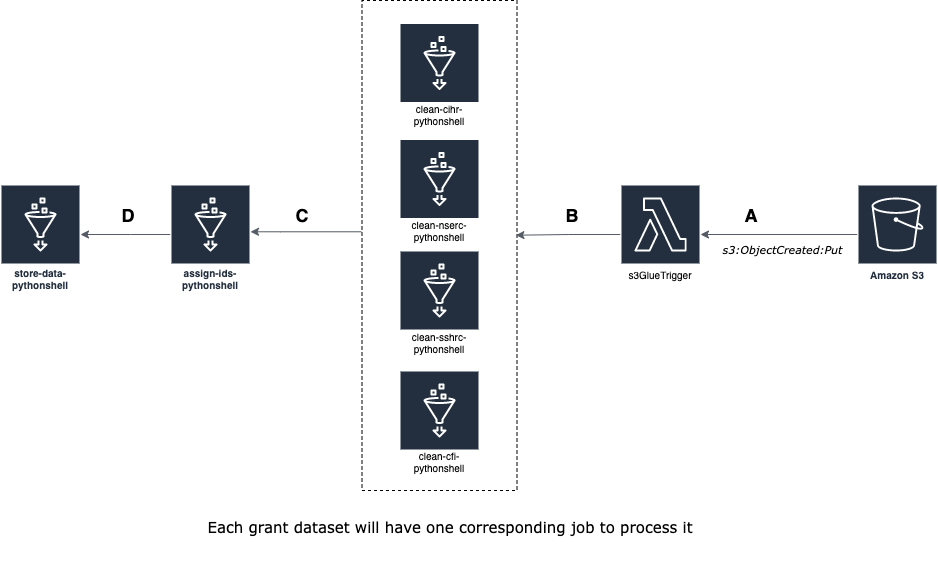
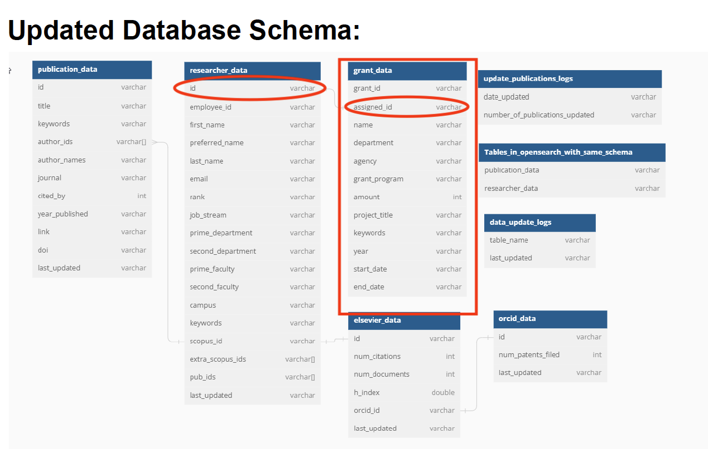

# Grant Data Pipeline Deep Dive

The goal of the Grant Data Pipeline is to initially populate the database with grant data, currently from 4 different grant sources:

1. Canadian Institutes of Health Research (**CIHR**)
2. Natural Sciences and Engineering Research Council of Canada (**NSERC**)
3. Social Sciences and Humanities Research Council (**SSHRC**)
4. Canada Foundation for Innovation (**CFI**)

For the pipeline to run, currently a total of 5 Comma-Separated-Value (CSV) files need to be uploaded to the designated S3 bucket with the proper folder structure. Detailed on how to perform this part is outlined in the [User Guide to Grant Downloads](User%20Guide%20to%20Grant%20Downloads.pdf), [Step 6 in the Deployment Guide](DeploymentGuide.md#step-6-upload-data-to-s3-for-the-grant-data-pipeline), or [Updating Grant Data section in the User Guide](UserGuide.md#updating-grant-data). Assuming the uploading process is done correctly, the entire pipeline will automatically run from start to end without needing further user intervention (unless there is an error).

This document will show exactly how that is achieved.

## 1. S3 Object Upload Event Notification

`raw` folder structure:

Amazon S3 Bucket has a functionality called Event Notification. Whenever a user Uploads/Delete/Copy a file inside a Bucket, they can set up an event notification that lets the bucket communicate with other cloud event services (SQS, SNS, Lambda). For this pipeline, S3 was set up a notification specifically for s3:ObjectCreated:PUT event, so that whenever the user uploaded the data, S3 will notify a Lambda function via Event Notification.

## 2. Lambda Function mapping event to the correct Glue job

### 2.1 Why do the folders follow a naming convention?

Lambda function is the event receiver and the "orchestrator" of the pipeline. The Function will always listen to uploading events originating from the **raw** folder first since it is the first folder to be created (uploaded by the user). The lambda then filters out what subfolders are contained inside **raw** then it always invokes the corresponding `clean-...-pythonshell`. For example, if the **raw** folder only contains 2 subfolders **cihr** and **nserc** along with the CSV files inside each, then the Lambda function will invoke the `clean-cihr-pythonshell` and `clean-nserc-pythonshell` Glue jobs. The Lambda function parses the exact name of the subfolder (case sensitive) to determine the Glue job to call, so if there is a subfolder called *new_grant_source* then it would also need a corresponding Glue job with the name *clean-new_grant_source-pythonshell* to clean the data. That is why a strict naming convention for subfolders at the initial upload was enforced.

### 2.2 Sequential invocations

After the Lambda function invoked the `clean-...-pythonshell` Glue jobs, they will create a temporary file that will be stored in the same S3 Bucket under the `clean` folder, with the same subfolders structure (4 subfolders). S3 event notification is also configured for this folder, and Lambda will invoke the next Glue Job called `assign-ids-pythonshell` 4 times. This Glue job will also output temporary files that are stored in the same bucket under the `ids-assigned` folder, and another set of notifications will be sent out to Lambda to invoke the final Glue job called `store-data-pythonshell` 4 times. In other words, the Lambda function listens to S3 notifications to orchestrate the Glue jobs in sequential order (clean -> assign ids -> store in database).

## 3. Data Cleaning

Currently, there are 4 different grant datasets, each with different schemas (columns). Each CSV dataset needs to be processed differently, but ultimately they need to end up with the same schema as the grant_data table that was set up in the PostgreSQL database to store the processed grant data.

Thus, there are 4 different Glue jobs called `clean-cihr-pythonshell`, `clean-nserc-pythonshell`, `clean-sshrc-pythonshell`, `clean-cfi-pythonshell` to clean each corresponding grant CSV data, since again each raw dataset has a different encoding format and schemas. They are using a powerful Python tabular-data library called [Pandas](https://pandas.pydata.org/docs/index.html) to manipulate the data. The cleaning process involves stripping off special characters, reformatting datetime encoding, trimming white space and splitting each researcher's name into first name and last name. The results will then be stored in the same S3 bucket under the `clean` folder, with the same subfolder structure as `raw`. This step ensures that all 4 datasets will have the same schema and that the data in each column are formatted the same way for the next step.

## 4. Name matching and assigning IDs

The first name & last name are compared to match the name of a researcher in the database. This process uses a string metric called Jaro-Winkler distance to determine if two names are the same. A researcher’s last name is compared first then the Jaro-Winkler distance of the first name is checked for each last name match. This order was chosen because researchers often shorten their first names which make it less reliable when matching. The whole idea of fuzzy name matching is that: Say in the database there is a researcher name Michael Doe, and in the grant data there is a researcher name Mike Doe, then the Jaro-Winkler distance will tell us how likely it is that these two names belong to the same actual person. Currently, the threshold is set at 0.95 (Jaro-Winkler goes from 0 - 1). When a match is found, it also includes the person's IDs from our database with that result, hence the "assigning IDs" part. After this step is done, it recombines the first names and last names into one name field. The final result is again stored in the same S3 bucket under the `ids-assigned` folder.

### Performance improvement

This step by far has taken the longest time to finish execution compared to the rest of the Grant Data pipeline. This is because for every row (a record) in the CSV files, the first & last name is compared with ALL researcher names in the PostgreSQL database to name match. Currently, there are roughly ~ 60000 rows of data from the 4 CSV files combined and more than ~ 7000 unique researcher names (at this point in time) in the PostgreSQL database. This is a tremendously time-consuming operation.

However, a lot of the grant entries belong to a similar name (researcher). In other words, a person can be awarded different grants with different projects, but still under the same researcher name because it's the same person, but for name matching, the algorithm is only interested in the researcher's name only. This presented a problem because if the same name appeared 4 times, it will be assigned the same unique IDs 4 times (because it's the same person), but **each** of the original 60000 rows of CSV data is compared with the 7000 names, thus this is a waste of computing performance.This brute-force method was tried this at first and it took around 45 minutes to finish executing.

Realizing this, the following extra steps were performed:
1. Create a new temporary DataFrame/table by retaining only the first and last name columns. The other columns are temporarily excluded (SUBSET 1).
2. Drop the duplicate names on that subset, only retain the first occurrence (the order of traversing the DataFrame/table is maintained at any time). This will create another subset (SUBSET 2).

**SUBSET 1** (Other columns are temporarily excluded, but the order of the rows is the same)

| First Name | Last Name |
| ---------- | --------- |
| Miguel | Cox |
| Miguel | Cox |
| Miguel | Cox |
| Miguel | Cox |
| Ashley | Holl |
| Ashley | Holl |

**SUBSET 2** (Duplicate names are dropped, only retain the first occurrence of each unique name)

| First Name | Last Name |
| ---------- | --------- |
| Miguel | Cox |
| Ashley | Holl |

3. Assign IDs on Subset 2 (SUBSET 3)

**SUBSET 3**

| First Name | Last Name | Assigned ID |
| ---------- | --------- | -- |
| Miguel | Cox | 419 |
| Ashley | Holl | 68 |

4. Take SUBSET 3 and perform a relational [Left-Join](https://www.w3schools.com/sql/sql_join_left.asp) on the original DataFrame/table

**FINAL result**

| First Name | Last Name | Assigned ID | Other columns |
| ---------- | --------- | ----------- | ------------- |
| Miguel | Cox | 419 | ... |
| Miguel | Cox | 419 | ... |
| Miguel | Cox | 419 | ... |
| Miguel | Cox | 419 | ... |
| Ashley | Holl | 68 | ... |
| Ashley | Holl | 68 | ... |

Since assigning IDs on unique occurrence of each name and left join take less time computationally (thanks to the powerful Python [Pandas](https://pandas.pydata.org/docs/index.html) library), this improvement was made possible. Overall, this enhancement reduced the cumulative time for the Name Match and Assign IDs step from **~ 45 minutes down to ~ 15 minutes (~ 67 percent improvement)**.

## 5. Store data

The data is now processed and ready to be imported into the database under the `grant_data` table. Only  the grant entries with the researcher_ids assigned were imported since it indicates that the grant is associated with a researcher in our database.

### Relational Table Update in the PostgreSQL Database

For this new implementation to work, a new `grant_data` table is created, and also create an extra `id` field in the `researcher_data` table.

### 5.1 `researcher_data` table

| Column Name | Description | Source |
| ----------- | ----------- | ------ |
| id | a **unique ID** associated with a researcher | generated internally by the PostgreSQL Database Engine |
| other fields | no changes | no changes |

### 5.2 `grant_data` table

| Column Name | Description | Source |
| ----------- | ----------- | ------ |
| grant_id | the **unique ID** associated with each grant record | generated internally by the PostgreSQL Database Engine |
| assigned_id | the **unique ID** associated with a researcher | from the `researcher data`'s `id` field |
| name | the researcher name | CSV files |
| department | the department of the researcher | CSV files |
| agency | the granting agency (currently only CIHR, NSERC, SSHRC or CFI)| CSV files |
| grant_program | the specific program that the researcher applied for and was awarded the grant | CSV files |
| amount | the amount of grant awarded (in dollars) | CSV files |
| project_title | the title of a researcher's project | CSV files |
| keywords | the keywords associated with that project | CSV files |
| year | the fiscal year | CSV files |
| start_date | the start date (effective date) of the grant | CSV files |
| end_date | the end date (expiry date) of the grant | CSV files |