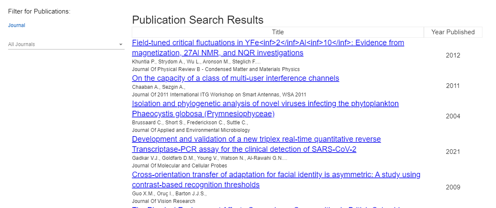
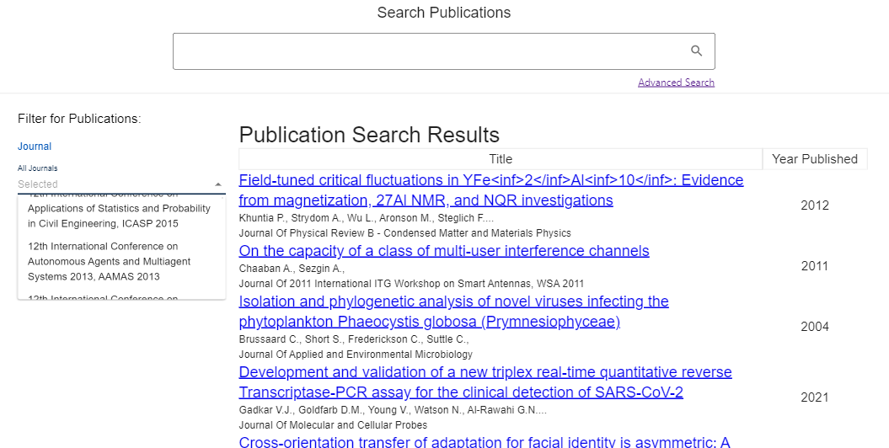
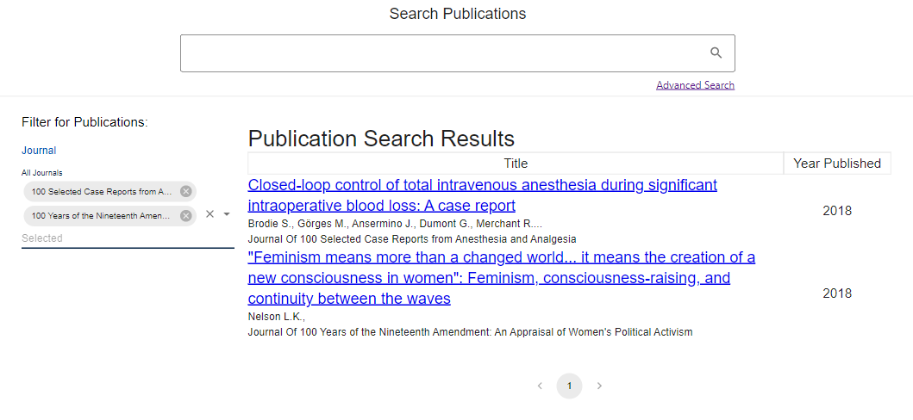
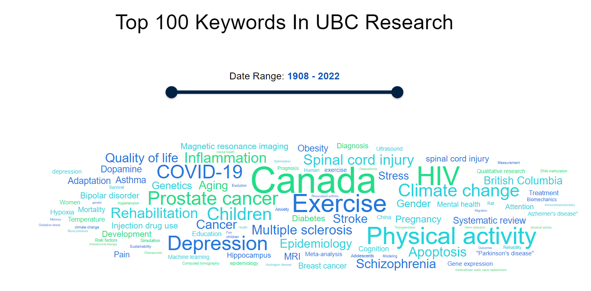

# User Guide

**Before Continuing with this User Guide, please make sure you have deployed the frontend and backend stacks.**

- [Deployment Guides](./DeploymentGuide.md)

| Index                                       | Description                                           |
| :------------------------------------------ | :---------------------------------------------------- |
| [Home](#Home)                               | Main search bar (Search Everything)                   |
| [Researchers Search](#Researchers-Search)   | Researcher search and related filters                 |
| [Publications Search](#Publications-Search) | Publications search and related filters               |
| [Advanced Search](#Advanced-Search)         | Advanced search                                       |
| [Rankings](#Rankings)                       | Researcher rankings by department or faculty          |
| [Metrics](#Metrics)                         | Top 100 research keywords word cloud                  |
| [Admin Dashboard](#Admin-Dashboard)         | Update logs, Changing Scopus IDs, Viewing Flagged IDs |

**Note:** The screenshots contained in this User Guide show some information as redacted to obscure data that is not fully up to date.
 

## Home

The Home page is a combination of both the [Researchers Search Component](#Researchers-Search) and the [Publications Search Component](#Publications-Search), containing a search bar that returns both researcher and publication results that match the user-inputted search term. The researcher results are displayed on the top section of the home page, and publication results are displayed below.

## Researchers Search

The search bar on this page returns researcher results that match the user inputted search term. Filters for researchers can be found on the left hand sidebar. There are 2 categories to filter by (Department, Faculty).

Clicking on the `Show All` button will open a window displaying all the possible options for the filter category. To select the options you would like to filter by, click the checkbox beside the option name. Then click `Apply Filters`. Multiple filter options can be selected from both the Department and Faculty category.

## Publications Search

The search bar on this page returns publication results that match the user inputted search term. The filter for publications can be found on the left hand sidebar. There is one category to filter by (Journal). Clicking on the `All Journals` tab will open a dropdown displaying all the possible journal options.

To select the journal options you would like to filter by, click the journal name and the selected journal will appear above the dropdown menu.

## Advanced Search

The advanced search page offers a more detailed method of finding information on the website, and increases search accuracy by allowing users to specify additional requirements for a search.

The advanced search page can be accessed by clicking the `Advanced Search` button underneath the search bar in either the Home tab (will return results for both researchers and publications), Researchers tab (will only return results for researchers) or Publications tab (will only return results for publications).

There are 4 possible advanced search fields.

1. Include All These Words

   - Separate each key word with a space character
   - eg. If you would like the words "Covid-19" and "pandemic" to both be included in your search results, enter `Covid-19 pandemic` into the text field.

2. Include These Exact Phrases

   - Enter the phrase you would like to search for in quotation marks
   - eg. If you would like a publication to include the phrase "Covid-19 Pandemic Effects", enter `"Covid-19 Pandemic Effects"` into the text field.

3. Include Any Of These Words

   - Separate each key word with a space character
   - eg. If any of the words "Covid-19", "pandemic", or "effects" can be included in your search results, enter `Covid-19 pandemic effects` into the text field.

4. Do Not Include Any Of These Words

   - Separate each key word that cannot be included with a minus (-) character
   - eg. If you do not want any of the words "Covid-19", "pandemic", or "effects" to be included in your search results, enter `-Covid-19 -pandemic -effects` into the text field.

 

Search results can also be refined by filtering researchers by department or by faculty. Publications can be filtered by year and by journal.
 

## Rankings

The Rankings tab displays a table with all researchers ranked by their H index for the past 5 years. Rankings can be filtered by department or by faculty by clicking on the `Rank By Department` or `Rank By Faculty` toggle tabs above the rankings table.

## Metrics

The Metrics tab displays a word cloud containing the top 100 keywords in UBC research during a user selected date range. The font size of each word in the word cloud corresponds to the frequency that that word has appeared in publication titles during the selected date range. The earliest available year is 1908, and the latest available year is the current year.

The selected date range can be changed by moving either one of the date range slider buttons. A new word cloud will then be formed with the words for the updated date range.

//new image here

To view the exact number of times a certain keyword has appeared, hover over the word and a popup will appear. If you would like to search for that keyword, click the word to open a new tab containing the search results.

## Admin Dashboard

The admin dashboard page is only accessible by admin users. Once the user has logged in, this page is used for viewing logs of when data has been updated on the site, changing Scopus IDs of researchers on the site, and viewing any discrepencies in researcher entries.

The admin dashboard page contains three tabs.

### 1. Logs

The Logs tab contains two tables. The first table displays logs of the time at which publications are updated, as well as the number of publications that are updated. The second table displays logs of the time at which researchres are updated, as well as the name of the researcher that are updated.

### 2. Change Scopus IDs

The Change Scopus IDs tab allows admin users to change the Scopus ID of any researcher. To change a Scopus Id, begin by entering the current researcher Scopus ID that you would like to change. Then click `Look Up Scopus ID`. This will open a window displaying the information of the researcher associated with that Scopus ID. Enter the new Scopus ID in the text field beside `Input New Scopus ID:`. Then click the `Change Scopus ID` button on the lower right hand side of the window.

### 3. Flagged IDs

The flagged IDs tab displays researchers that have had their Scopus ID flagged. At the top of the page, there will be a message showing how many researchers there currently are with flagged IDs. Below that, flagged researcher entries are grouped into tables with the columns containing Researcher Name, Scopus ID, Employee ID, Department, Faculty and Reason Flagged information.
